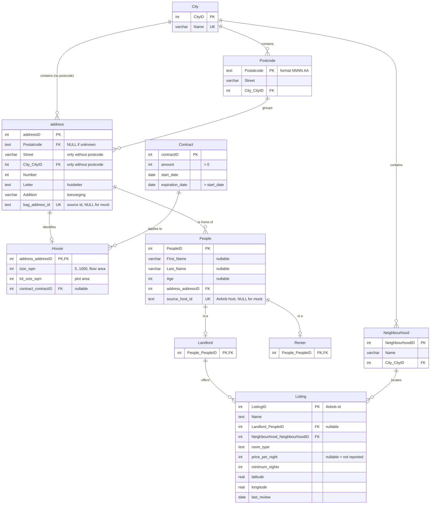

# ERD - schema v2 (after week 5)

This diagram documents the schema **as implemented now** (`database/schema.sql`), so it can be
compared with the original ERD in [`Erd_report.pdf`](Erd_report.pdf).
GitHub renders the Mermaid below automatically.

Changes versus the week 2 ERD are listed under the diagram.

## What changed since the week 2 ERD

| Change | Why | Detail |
|---|---|---|
| **New entity `Postcode`** | 3NF fix | `Postalcode -> Street, City` was a transitive dependency inside `address`. See [`normalization_report.md`](normalization_report.md). `Street` and `City_CityID` moved out of `address`. |
| **New entities `Neighbourhood` and `Listing`** | Airbnb data has no street address | Listings attach to a neighbourhood, not to a `House`. |
| **`address` gained `Letter`, `Addition`** | real house numbers are `12A`, `12-2`, `12 1L` | week 2 modelled only `number (smallINT)` |
| **Source-id columns** (`bag_address_id`, `source_host_id`) | traceability, prevents double loading | not in the week 2 ERD |
| **`Age`, `First_Name` now optional** | Airbnb hosts have neither | week 2 assumed both always known |
| **`Postalcode` is TEXT, not INT** | `1015 NR` is not a number | week 2 listed `Postalcode (int)` |
| **`address.Postalcode` optional, `Street`/`City_CityID` on `address`** | Kaggle houses have no postcode | filled only when the postcode is unknown; the view `address_full` returns street and city for every address |
| **`House.lot_size_sqm`** | Kaggle gives the plot area, not the floor area | `size_sqm` is now optional, one of the two is required |

## Still not modelled

The week 2 ERD gives `Landlord/contractor` a `houseID` so a landlord manages houses.
**That link is still missing**, in week 3 and here. Until it is added, the database cannot
answer "who rents out this house", which is central to the project's goal. Adding it
requires a group decision on cardinality, so it is deliberately not invented here.

`Renter` also still has no attributes. The README describes matching renters to houses on
maximum rent, location and contract dates, but none of those are stored.
